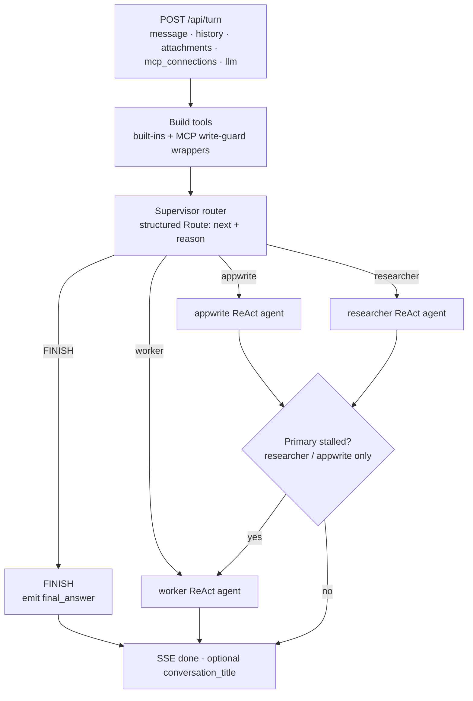

# Appwrite Assistant (LangGraph)

POC assistant engine for Appwrite Cloud `/v1/assistant`, built on [LangGraph](https://github.com/langchain-ai/langgraph).

**Stateless by design.** Cloud (or any proxy) owns conversation persistence, Realtime, and auth. The UI/client owns MCP OAuth and credentials. This service is the agent runtime only — every turn receives the context it needs over the API.

## What you get

- **One-shot router + subagents** (`appwrite`, `researcher`, `worker`) via LangGraph `create_react_agent` — each turn routes once (with an optional worker fallback if the primary agent stalls)
- **Appwrite expert** with official [agent-skills](https://github.com/appwrite/agent-skills) vendored under `.agents/skills/`
- **Safe tools by default** — no host shell for the model
- Tools: `calculator`, `current_time`, `web_search`, `browser_fetch`, `appwrite_skill`, `sandbox_exec` stub, plus MCP tools from credentials on the turn
- FastAPI + shadcn chat UI

## Agent architecture

Each `POST /api/turn` is one independent run. The engine builds tools for that turn (built-ins + MCP from the request), routes once with structured output, then streams a single LangGraph ReAct subagent.



| Role | When it runs | Tools |
|------|--------------|-------|
| **Supervisor** | Every turn (routing only; may answer directly via `FINISH`) | None — structured `Route` decision |
| **appwrite** | Appwrite product, SDK/CLI, or live project ops | `appwrite_skill` + shared tools + MCP |
| **researcher** | Open-web research, calc, fetch | Shared tools + MCP |
| **worker** | Plans / generic answers; also **fallback** if researcher/appwrite looks failed | Shared tools + MCP |

**Shared tools:** `calculator`, `current_time`, `web_search`, `browser_fetch`, `sandbox_exec` (stub). MCP tools from `mcp_connections` are attached to every subagent; create mutations are write-guarded (dedupe / `already_exists` recovery).

**Turn shape:** route once → stream one subagent → optional worker fallback → `done`. History is trimmed to the last 12 turns server-side. No durable graph checkpoint — Cloud/proxy owns conversation state.

## Quick start

```bash
cp .env.example .env
# set ASSISTANT_API_KEY and LLM_API_KEY

# Stamp the image so /health and startup logs show which build is running
export ASSISTANT_BUILD_ID="$(git rev-parse --short HEAD)"
export ASSISTANT_BUILD_TIME="$(date -u +%Y-%m-%dT%H:%M:%SZ)"

docker compose up --build -d

curl -s http://127.0.0.1:8000/health
# → {"status":"ok","build_id":"abc1234","build_time":"2026-08-01T17:56:00Z"}

curl -sN -H "X-Session-API-Key: $ASSISTANT_API_KEY" \
  -H 'Content-Type: application/json' \
  -d '{"message":"What is 17*19?","history":[]}' \
  http://127.0.0.1:8000/api/turn
```

- API docs: http://127.0.0.1:8000/docs
- UI: http://127.0.0.1:3001

### Rebuild image only (tag used by cloud compose)

```bash
cd /path/to/eldadfux/openhands
docker build \
  --build-arg ASSISTANT_BUILD_ID="$(git rev-parse --short HEAD)" \
  --build-arg ASSISTANT_BUILD_TIME="$(date -u +%Y-%m-%dT%H:%M:%SZ)" \
  -t ghcr.io/eldadfux/openhands:dev \
  .

# Then recreate the cloud compose service that pulls that tag:
# cd cloud && docker compose --profile assistant up -d --force-recreate appwrite-assistant
# curl -s http://127.0.0.1:8000/health && docker logs appwrite-assistant 2>&1 | head -20
```

## API

| Method | Path | Notes |
|--------|------|-------|
| GET | `/health` | Liveness (+ build id/time) |
| GET | `/ready` | Env `LLM_API_KEY` present? |
| GET | `/api/meta` | Auth — runtime inspection (secrets masked) |
| POST | `/api/title` | Auth — short topic title for a conversation opener |
| POST | `/api/turn` | Auth — one turn (SSE) |

`POST /api/turn` requires either env `LLM_API_KEY` or a per-turn `llm.api_key`. `/ready` only checks the env default.

### Turn request

```json
{
  "message": "What is 17*19?",
  "history": [
    { "role": "user", "content": "Hi" },
    { "role": "assistant", "content": "Hello!" }
  ],
  "attachments": [
    { "name": "notes.txt", "mime": "text/plain", "content_base64": "..." }
  ],
  "mcp_connections": [
    {
      "id": "appwrite",
      "name": "Appwrite",
      "url": "https://mcp.appwrite.io/",
      "tokens": { "access_token": "...", "refresh_token": "..." },
      "client_info": { "client_id": "..." }
    }
  ],
  "llm": {
    "api_key": "...",
    "model": "openai/gpt-5.6",
    "base_url": "https://api.openai.com/v1",
    "temperature": 0.2
  }
}
```

| Field | Required | Notes |
|-------|----------|-------|
| `message` | one of message / attachments | User text for this turn |
| `history` | no | Prior `{role, content}` pairs (last 12 kept server-side) |
| `attachments` | no | Inline files via `content_base64` |
| `mcp_connections` | no | Full MCP URL + tokens + `client_info` for this turn |
| `llm` | no | Per-turn credential/model override (see below) |

**`llm` override.** Optional object merged over env `LLM_*` for this turn only. Omitted fields keep the env defaults. Cloud uses this when a conversation selects a user-owned model (`assistantModels`); omit it to use the shared Appwrite default. The key is never logged. GPT-5 reasoning models and the o-series omit custom `temperature` and run on the Responses API (`use_responses_api`) so function tools work; chat models like `gpt-4o` keep Chat Completions + temperature.

### Title request

```json
{ "message": "How do I create a database?", "assistant_message": "..." }
```

Returns `{ "title": "..." }`. Uses the env LLM only (no per-turn `llm` override).

SSE events from `/api/turn` include `status`, `route`, `subagent_start` / `subagent_end`, `answer_start`, `tool_start` / `tool_end`, `token`, `mcp_credentials` (refreshed tokens for the client to store), `conversation_title` (first turn only), `done`, `error`, and a final `complete`.

## MCP OAuth (client-owned)

The engine does **not** run OAuth. The UI (or production proxy) does:

1. Discover protected-resource + authorization-server metadata
2. Dynamic client registration (public client + PKCE)
3. Browser authorize → callback at `{origin}/oauth/mcp/callback`
4. Store `tokens` + `client_info` in localStorage
5. Send them on every `/api/turn` as `mcp_connections`

Production Appwrite should own steps 1–4 and replay credentials on each turn the same way.

## Environment

| Variable | Required | Purpose |
|----------|----------|---------|
| `ASSISTANT_API_KEY` | yes (prod) | Clients send `X-Session-API-Key` |
| `LLM_API_KEY` | yes* | Default model provider API key (`*` or supply `llm.api_key` per turn) |
| `LLM_MODEL` | no | Default `openai/gpt-5.6` (overridable via `llm.model`) |
| `LLM_BASE_URL` | no | Optional OpenAI-compatible base URL (overridable via `llm.base_url`) |
| `WEB_SEARCH_ENABLED` | no | Headless browser web search (default `true`) |
| `ATTACHMENTS_MAX_BYTES` | no | Max inline attachment size (default 10MB) |
| `ATTACHMENTS_MAX_PER_MESSAGE` | no | Max attachments per turn (default 8) |
| `STREAM_TOOL_INPUT_CHARS` | no | Cap tool-input preview on SSE (default 100000) |
| `STREAM_TOOL_OUTPUT_CHARS` | no | Cap tool-output preview on SSE (default 500000) |

## Security

- Do not expose this container on a public Gateway/HTTPRoute.
- The model cannot run host shell commands.
- Unauthenticated mode (empty API key) is for local smoke tests only.

## Appwrite skills

```bash
./scripts/update-appwrite-skills.sh
docker compose up --build -d assistant
```

## Local (no Docker)

```bash
python -m venv .venv && source .venv/bin/activate
pip install -r requirements.txt
playwright install chromium
export LLM_API_KEY=... ASSISTANT_API_KEY=...
uvicorn app.main:app --reload --port 8000
```
